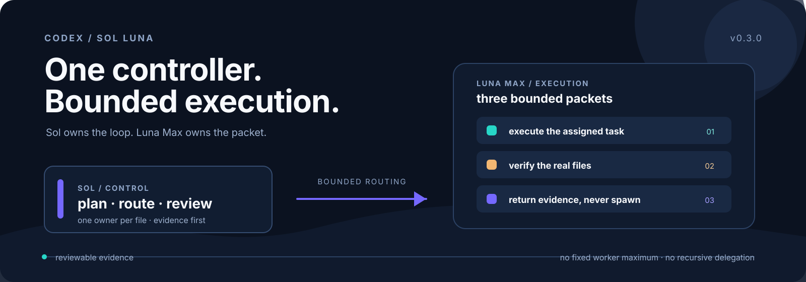
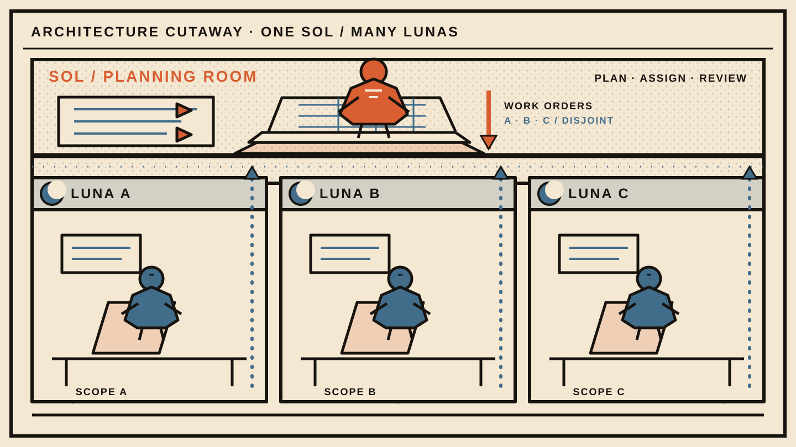

[简体中文](README.md) · [English](README.en.md)

# Sol Luna

`codex-sol-luna` is a deliberately small Codex orchestration Skill: Sol is the
single controller that understands, plans, splits, assigns, and reviews; Luna
Max executes bounded tasks, verifies the work, and returns evidence.

## Estimated cost saving: about 59%

Under the current typical model, Luna Max performs about 70% of the execution
work at 115% of the delegated token baseline while added Sol planning and review
costs 8%. The resulting whole-workflow estimate is about **59% lower**.

**Conservative estimate: about 38% · Execution-heavy estimate: about 74%**

This is a modeled estimate based on the 2026-08-02 pricing snapshot and public
formula, not a guarantee for every task. Direct tasks claim 0% routing savings;
repeated context, poor decomposition, retries, or heavy Sol review can reduce or
erase the benefit. Full pricing, formula, and evidence boundaries appear below.



> One controller. Bounded execution. Reviewable evidence.

The canonical repository is [yehyakin/codex-sol-luna](https://github.com/yehyakin/codex-sol-luna).
Invoke the Skill explicitly with `$sol-luna` when the work is complex,
parallelizable, or high consequence.

## Architecture



Sol is the single controller: it understands the goal, defines observable
completion criteria, plans the stages, assigns ownership, routes work, and makes
the final review decision. Luna Max workers execute only the bounded packets
they receive, verify their own changes, and return evidence. Luna may not create
subagents, and the worker count is dynamic rather than a promised fixed maximum.

```text
User goal → Sol plans and routes → Luna Max executes bounded tasks
          → Sol reviews files, diffs, and evidence → delivery
```

The public surface stays intentionally small:

| Role | Responsibility | Boundary |
| --- | --- | --- |
| Sol | Controller, planner, router, and reviewer | Read-only orchestration and final decision |
| Luna Max | Bounded implementation and self-verification | Assigned files only; no recursive delegation |

## When to use — and when to stay direct

Use `$sol-luna` for:

- a multi-part change with clear seams and independent work;
- parallelizable implementation where every file can have one owner;
- high-consequence work where a second review of the real diff and evidence is valuable;
- a plan that needs explicit stages, dependencies, and a falsifiable `done_when`.

Stay direct when:

- the task is a small, self-contained edit or a quick explanation;
- the goal is still too ambiguous to split into bounded packets;
- delegation, repeated context, or a review pass would cost more than it helps;
- planning or review is the only work required. Planning-only work may use zero
  Luna workers, and direct tasks claim 0% routing savings.

An explicit `$sol-luna` invocation always starts with Sol. Ordinary simple work
remains direct unless the Skill is explicitly selected.

Runtime output defaults to Simplified Chinese for Sol plans and reviews, Luna
task results, and status updates. An explicit user request for another language
overrides this default. Code, commands, paths, identifiers, and original
evidence may retain their source language.

## Platform support and quickstart

The lifecycle has two supported command families:

| Target | Shells | Status boundary |
| --- | --- | --- |
| macOS | POSIX shell | Supported by the `bash` lifecycle scripts |
| Linux | POSIX shell | Supported by the `bash` lifecycle scripts |
| Windows 11 | Windows PowerShell 5.1 and PowerShell 7.x | Supported target; native Windows 11 evidence is a separate release gate |
| Windows Server 2022 | Windows PowerShell 5.1 and PowerShell 7.x | Supported target; GitHub-hosted CI is Server evidence |

GitHub Actions uses `windows-latest` and pinned `windows-2022` for the Windows
matrix. Those hosted runners provide Windows Server evidence; they must not be
described as native Windows 11 evidence.

### macOS and Linux

From a checkout of [codex-sol-luna](https://github.com/yehyakin/codex-sol-luna):

```sh
bash scripts/validate.sh
bash scripts/install.sh
```

To remove the installation or restore the latest valid backup:

```sh
bash scripts/uninstall.sh
bash scripts/uninstall.sh --restore-latest
```

For an isolated test home, set `ORCHESTRATE_HOME` to a unique temporary
directory before running the commands. The installer backs up exact existing
targets, installs atomically, and leaves unrelated agents and
`~/.codex/config.toml` alone.

### Windows 11 and Windows Server 2022

The Windows lifecycle is native PowerShell and is written to remain compatible
with both PowerShell 5.1 and PowerShell 7.x. Use `powershell.exe` for Windows
PowerShell 5.1 or `pwsh` for PowerShell 7:

```powershell
powershell.exe -NoProfile -ExecutionPolicy Bypass -File scripts/validate.ps1
powershell.exe -NoProfile -ExecutionPolicy Bypass -File scripts/install.ps1
powershell.exe -NoProfile -ExecutionPolicy Bypass -File scripts/uninstall.ps1
powershell.exe -NoProfile -ExecutionPolicy Bypass -File scripts/uninstall.ps1 -RestoreLatest
```

The equivalent PowerShell 7 commands are:

```powershell
pwsh -NoProfile -File scripts/validate.ps1
pwsh -NoProfile -File scripts/install.ps1
pwsh -NoProfile -File scripts/uninstall.ps1
pwsh -NoProfile -File scripts/uninstall.ps1 -RestoreLatest
```

Set `$env:ORCHESTRATE_HOME` to a unique temporary home when running isolated
Windows lifecycle tests. A Windows Server CI pass proves Server behavior only;
this README does not claim native Windows 11 evidence until a real Windows 11
run is recorded.

## Why it is reliable: identity, ownership, evidence, and correction

### Runtime identities and fail-closed behavior

The runtime identities are exact and intentionally boring:

| Agent | Model | Reasoning effort | Effective sandbox |
| --- | --- | --- | --- |
| `sol-controller` | `gpt-5.6-sol` | `high` | `read-only` |
| `luna-max-worker` | `gpt-5.6-luna` | `max` | `workspace-write`, bounded by the parent |

Sol is the single controller; Luna Max workers execute bounded tasks and return
evidence. The runtime must prove the selected custom agent, exact model,
reasoning effort, and effective permission boundary at launch. Configuration
text or an agent label is not proof. If any identity or permission cannot be
proved, the runtime **fails closed** instead of silently substituting a nearby
model, role, effort, or sandbox.

Luna Max may not spawn or create subagents. It also may not widen its write
scope, redesign Sol's plan, approve the overall task, or treat a partial result
as delivery.

### Stages, ownership, evidence, and correction

Sol's plan has four small responsibilities:

1. **Plan and route.** Sol records the concrete `goal`, observable `done_when`
   criteria, bounded tasks, exact `write_scope`, exclusions, dependencies, and
   verification commands.
2. **Execute.** Luna receives one packet with a stable `Task ID`, `Task`,
   optional `Context`, `Write scope`, `Do not touch`, `Expected result`, and
   `Verification`. One file has one owner for the entire run. Independent
   disjoint scopes may run in parallel; uncertain or overlapping scopes wait.
3. **Review.** Sol inspects the real files, complete diff, test output, and
   returned evidence. A worker's result is not a substitute for Sol's review.
4. **Correct or deliver.** Sol may issue at most one focused correction to the
   original owner inside the original scope. A second failure, a missing
   dependency, or an expanded scope is `BLOCKED`; only Sol decides `PASS` for
   the overall task.

Live capacity controls batching, not the architecture. If fewer workers are
available, ready tasks remain queued; the plan never assumes a fixed Luna
maximum.

A worker result is deliberately falsifiable:

```text
Task ID: <stable task id>
Status: PASS | BLOCKED
Summary: <what happened>
Changed: <exact files, or None>
Verification: <commands, exit status, and concise output>
Evidence: <diff, test, build, log, or artifact location>
Blocker: <None or the concrete blocker>
```

### Install, validate, uninstall, backup, and rollback

The installers validate source files before the first mutation, resolve exact
literal paths, reject unsafe roots and reparse points, and use checksums to
protect owned targets. Existing targets are backed up before replacement;
staging and rollback keep a failed install from becoming a half-installed one.

The lifecycle preserves `~/.codex/config.toml` and unrelated agents. An
unmodified legacy v0.1 installation may be migrated, while a modified legacy
target is retained rather than silently deleted. Uninstall removes only owned
targets whose recorded `SHA256` still matches. A changed target is refused, not
overwritten. `-RestoreLatest` / `--restore-latest` restores the latest valid
recorded backup after the owned installation has been removed.

The macOS/Linux commands are:

```sh
bash scripts/validate.sh
bash scripts/install.sh
bash scripts/uninstall.sh
bash scripts/uninstall.sh --restore-latest
```

The Windows commands are:

```powershell
pwsh -NoProfile -File scripts/validate.ps1
pwsh -NoProfile -File scripts/install.ps1
pwsh -NoProfile -File scripts/uninstall.ps1
pwsh -NoProfile -File scripts/uninstall.ps1 -RestoreLatest
```

The PowerShell validation and lifecycle files are owned by the Windows work
stream. Their supported targets and commands are documented here independently
of native Windows 11 evidence.

## Real-project benchmark

We reused completed Sol Luna task evidence first and allowed only the minimum
read-only probes needed for material gaps. Existing records covered all three
routing categories, so no additional model call was required and no business
project was modified. Public results retain anonymous aggregate categories only.

| Anonymous category | Route | Luna workers | Waves | Verification | Sol review | Elapsed |
| --- | --- | ---: | ---: | --- | --- | ---: |
| Codebase | `sol_then_luna` (`measured`) | `unavailable` | `unavailable` | evidence present (`measured`) | `BLOCKED` (`measured`) | 2340 s (`measured`) |
| Documentation | `sol_then_luna` (`measured`) | `unavailable` | `unavailable` | evidence present (`measured`) | `PASS` (`measured`) | 379 s (`measured`) |
| Infrastructure | `direct` (`measured`) | 0 (`measured`) | 0 (`measured`) | evidence present (`measured`) | not applicable (`measured`) | 859 s (`measured`) |

Evidence is labeled `measured`, `estimated`, or `unavailable`. The current
**59%** remains `estimated`; because comparable exact per-model usage was not
exposed, a real-project `measured` cost saving remains `unavailable`.

See [`tests/real-project-benchmark.md`](tests/real-project-benchmark.md) for the
complete method, anonymous result, and limitations.

## Cost model and pricing snapshot

This model separates the price of an API token from the capacity represented by
a subscription credit. The official sources are the [OpenAI API pricing
page](https://developers.openai.com/api/docs/pricing) and the official
[Codex/ChatGPT rate card](https://learn.chatgpt.com/docs/pricing). This snapshot
is dated **2026-08-02**; recheck both sources on release day.

### Standard short-context API prices per 1M tokens

| Model | Input | Cached input | Cache write | Output |
| --- | ---: | ---: | ---: | ---: |
| GPT-5.6 Sol | $5.00 | $0.50 | $6.25 | $30.00 |
| GPT-5.6 Luna | $0.20 | $0.02 | $0.25 | $1.20 |

### ChatGPT credits per 1M tokens

| Model | Input | Cached input | Output |
| --- | ---: | ---: | ---: |
| GPT-5.6 Sol | 125 | 12.5 | 750 |
| GPT-5.6 Luna | 5 | 0.5 | 30 |

Across these token categories, Luna costs `1/25` of Sol. Moving an otherwise
identical worker-token segment from Sol to Luna therefore reduces that segment
by **96%**. That is a segment comparison, not a promise about an entire task.

The whole workflow still spends Sol tokens on planning and review, and Luna may
read repeated context. The transparent estimate is:

```text
savings = delegated_share * (1 - luna_duplication / 25) - sol_overhead
```

Here:

- `delegated_share` is the share of an all-Sol run that Luna performs instead;
- `luna_duplication` is Luna's token volume relative to that delegated baseline;
- `sol_overhead` is additional Sol planning and review beyond the all-Sol
  baseline.

| Scenario | Delegated share | Luna duplication | Added Sol overhead | Estimated saving |
| --- | ---: | ---: | ---: | ---: |
| Conservative | 50% | 125% | 10% | about 38% |
| Typical | 70% | 115% | 8% | about 59% |
| Execution-heavy | 85% | 110% | 7% | about 74% |

For a simple reference point, an all-Sol short-context workload with 1M input
and 0.1M output costs about **$8.00** or **200 ChatGPT credits**. Under the
typical assumptions, the routed equivalent is about **$3.30** or **82.4
credits**, a reduction of about **59%**.

These estimates are a model, not a benchmark or a guarantee. Direct tasks claim
**0%** routing savings. Poor decomposition, repeated retries, unusually large
Sol reviews, or low delegation can reduce or reverse the benefit; retries can
erase savings entirely. API users may see monetary dollar savings. Subscription
users primarily receive more usable capacity or credits, unless routing also
avoids buying extra credits or moving to a higher plan. API dollar savings and
subscription capacity are different claims.

## Repository layout, testing, limitations, prior art, and license

### Repository layout

```text
.agents/skills/sol-luna/       public Skill and operating references
.codex/agents/                 exact Sol and Luna custom-agent definitions
scripts/                       macOS/Linux lifecycle and validation scripts
tests/                         contract, forward-case, and lifecycle tests
docs/assets/                   repository-owned hero and architecture SVGs
README.md                      canonical Simplified Chinese guide
README.en.md                   complete English peer
```

The public Skill is [`$sol-luna`](.agents/skills/sol-luna/SKILL.md). The exact
agent definitions are [`sol-controller.toml`](.codex/agents/sol-controller.toml)
and [`luna-max-worker.toml`](.codex/agents/luna-max-worker.toml). Global Skill
and agent directories are installed copies; GitHub is the source of truth.

### Testing

Run the focused documentation contract and the repository URL contract with
Python 3.11 or newer:

```sh
python -m unittest tests/test_readme.py
python -m unittest tests/test_contract.py
```

The documentation contract checks bilingual language switches and parity,
canonical links, local image targets, accessible SVG metadata, section order,
pricing rows, formula assumptions, scenario estimates, and disclaimers. The
repository contract checks the runtime names and Windows contract artifacts.
When PowerShell is available, the lifecycle tests also exercise isolated homes
with `ORCHESTRATE_HOME` and verify that `config.toml` and unrelated agents keep
their hashes.

### Limitations

- The estimates above are assumptions, not benchmarks, guarantees, or a claim
  that every routed task is cheaper.
- Delegation adds planning, context, review, and possible retry tokens.
- GitHub-hosted Windows runners establish Windows Server behavior, not native
  Windows 11 behavior.
- The Skill is intentionally two-role: Sol controls, and Luna Max executes. It
  is not a general-purpose multi-agent team framework.
- A clean final decision still depends on real files and fresh verification;
  configuration labels alone cannot prove runtime identity.

### Prior art

The design was informed by reviewed snapshots of projects exploring routing,
bounded delegation, parallel scheduling, and evidence-based review. No prose or
code was copied from them:

- [orchestrate-sol-luna](https://github.com/joeke80215/orchestrate-sol-luna/tree/eba163a9d48f023aeb3638b6809f0f8fb343f472) — Apache-2.0.
- [codex-parallel-subagent-planner](https://github.com/manhua-man/codex-parallel-subagent-planner/tree/ea3d8db9081e2f4159a6c40100fc1ca8d229e7dc) — no license file in the reviewed snapshot; ideas only.
- [codex-dispatch-skill](https://github.com/yinguangyao/codex-dispatch-skill/tree/00630de4c8ad01cb51bae3a89044d55cc6433158) — no license file in the reviewed snapshot; ideas only.
- [codex-orchestrate](https://github.com/douglasmonsky/codex-orchestrate/tree/f2954a066e2607deef3963465562193a220dee70) — MIT.
- [subagent-orchestrator-skill](https://github.com/Glaicer/subagent-orchestrator-skill/tree/96eaeb16f19b789fd004b588858fb846cc674147) — MIT.

### License

This repository is licensed under [Apache License 2.0](LICENSE). Attribution
context for reviewed prior art is recorded in [NOTICE](NOTICE).
