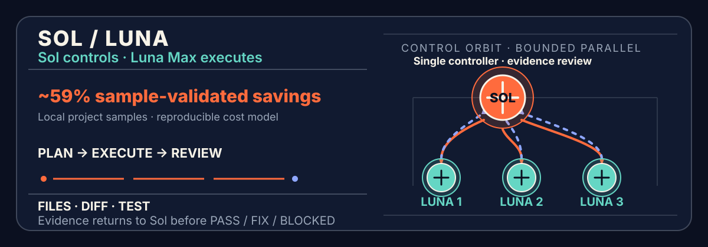
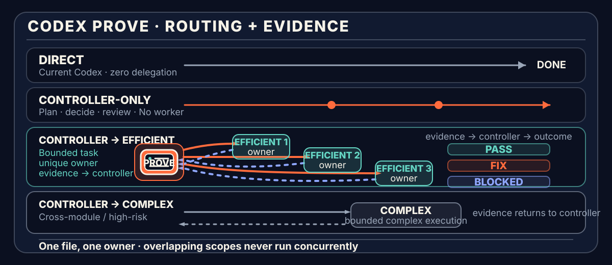

[简体中文](README.md) · [English](README.en.md)



# Sol Control

**One Sol controller. Terra High and Luna Max as tiered executors. Real files and evidence before delivery.**

`codex-sol-control` is a lightweight orchestration Skill for Codex. It does not optimize for “more agents.” It gives each model the kind of work it is best suited to perform:

- **Sol** is the single controller: understand the goal, define completion criteria, plan, assign, schedule, and perform the final review.
- **Terra High** is the complex execution tier: cross-module work, long-context investigation, ambiguous debugging, shared interfaces, and high-risk implementation.
- **Luna Max** is the lightweight execution tier: clear, low-ambiguity, tightly bounded, independently verifiable work.

Simple tasks stay with the current Codex session. Explicitly invoke `$sol-control` for work that is complex, cross-module, parallelizable, or high-consequence.

> **v0.4.x compatibility:** the old `$sol-luna` command remains available for explicit invocation, but only redirects to `$sol-control`; it does not start a second orchestration flow. Use `$sol-control` for new configuration. The alias is scheduled for removal in v0.5.0.

Runtime output defaults to Simplified Chinese unless the user explicitly requests another language.

> **One Sol, two execution tiers. Terra and Luna are leaf executors: neither may create subagents or approve the overall task.**

Canonical repository: [yehyakin/codex-sol-control](https://github.com/yehyakin/codex-sol-control)

## Core routing and projected savings

The table below uses an “all work performed by Sol” baseline of `1.00×`. Model token shares total 100%. `Orchestration overhead` represents additional Sol planning, review, coordination, and necessary rework as a fraction of the all-Sol baseline.

| Scenario | Example token routing | Orchestration overhead | Projected saving |
| --- | --- | ---: | ---: |
| **Ordinary clear project** | Sol 10% · Terra 20% · Luna 70% | 3%–7% | **72.2%–76.2%** |
| **Mixed project** | Sol 20% · Terra 40% · Luna 40% | 2%–12% | **50.4%–60.4%** |
| **Complex project** | Sol 25% · Terra 60% · Luna 15% | 7%–17% | **33.4%–43.4%** |
| **Direct small task** | The current Codex completes it without delegation | 0% | **0% routing saving** |

## Why it can reduce cost

The cost strategy is straightforward:

> **Keep goal interpretation, boundary decisions, and final review with Sol; route implementation to Terra or Luna according to complexity.**

Using the official API prices and Codex token-based rate card checked on **2026-08-04**, the relative cost of the same token type is:

| Model | Relative cost | Responsibility in this project |
| --- | ---: | --- |
| **Sol** | **1.00×** | Understand, plan, assign, schedule, and review |
| **Terra High** | **0.40×** | Complex, cross-module, long-context, or high-risk execution |
| **Luna Max** | **0.04×** | Clear, low-ambiguity, high-throughput execution |

For the same token type:

- Terra costs about **40%** of Sol;
- Luna costs about **4%** of Sol;
- Luna does not replace Sol—it moves large amounts of well-specified execution away from Sol while preserving Sol's judgment and review role.

These values are `scenario_model_projection`: they are planning estimates, **not matched A/B experiments, not per-task guarantees, and not latency promises**. Repeated context, poor decomposition, parallel waiting, output volume, Fast mode, and rework can reduce or reverse the saving.

A defensible public claim is therefore:

> **Ordinary clear projects can project roughly 72%–76% savings, typical mixed projects roughly 50%–60%, and complex projects roughly 33%–43%; actual results must be recalculated from real routing and token usage.**

It is not accurate to compress every workload into a fixed “56% average saving.”

<details>
<summary><strong>View official rates, formula, and full calculation</strong></summary>

### API prices

Per 1M tokens:

| Model | Input | Cached input | Output |
| --- | ---: | ---: | ---: |
| GPT-5.6 Sol | $5.00 | $0.50 | $30.00 |
| GPT-5.6 Terra | $2.00 | $0.20 | $12.00 |
| GPT-5.6 Luna | $0.20 | $0.02 | $1.20 |

### Codex token-based credits

Per 1M tokens:

| Model | Input | Cached input | Output |
| --- | ---: | ---: | ---: |
| GPT-5.6 Sol | 125 credits | 12.5 credits | 750 credits |
| GPT-5.6 Terra | 50 credits | 5 credits | 300 credits |
| GPT-5.6 Luna | 5 credits | 0.5 credits | 30 credits |

The current relative ratios are identical across both accounting surfaces:

```text
Sol = 1.00
Terra = 0.40
Luna = 0.04
```

That allows the same relative-cost formula:

```text
route_cost =
  sol_share × 1.00
  + terra_share × 0.40
  + luna_share × 0.04
  + orchestration_overhead

saving = 1 - route_cost
```

Ordinary clear project example:

```text
route_cost
= 0.10 × 1.00
+ 0.20 × 0.40
+ 0.70 × 0.04
+ 0.03–0.07
= 0.238–0.278

saving
= 1 - 0.238–0.278
= 72.2%–76.2%
```

API users see dollar charges; ChatGPT / Codex users usually see credits or included capacity. They are different accounting units, so API dollar savings should not be described as an identical subscription-bill saving.

Official sources:

- [OpenAI model comparison](https://developers.openai.com/api/docs/models/compare)
- [OpenAI Codex rate card](https://help.openai.com/en/articles/20001106-codex-rate-card)

A small subset of Enterprise workspaces still using the legacy rate card should use the rate card that actually applies to their workspace.

</details>

## 60-second quickstart

### macOS / Linux

```sh
git clone https://github.com/yehyakin/codex-sol-control.git
cd codex-sol-control

bash scripts/validate.sh
bash scripts/install.sh
```

### Windows

Windows PowerShell 5.1:

```powershell
git clone https://github.com/yehyakin/codex-sol-control.git
Set-Location codex-sol-control

powershell.exe -NoProfile -ExecutionPolicy Bypass -File scripts/validate.ps1
powershell.exe -NoProfile -ExecutionPolicy Bypass -File scripts/install.ps1
```

PowerShell 7:

```powershell
pwsh -NoProfile -File scripts/validate.ps1
pwsh -NoProfile -File scripts/install.ps1
```

After installation, open a new Codex session and explicitly invoke:

```text
$sol-control

Goal: Add account settings to the existing Next.js application.

Done when:
- Users can update their display name and avatar
- Existing authentication APIs remain compatible
- Required tests are added
- Lint, test, and build all pass

Do not:
- Modify the payments module
- Replace the existing UI framework
```

A one-line request also works:

```text
$sol-control Refactor the authentication module, preserve the current API, and make sure tests and build pass.
```

You do not need to choose a worker count or decide which tasks belong to Terra or Luna. Provide the **goal, observable completion criteria, and important constraints**; Sol creates the smallest useful plan.

## What it solves

| Common problem | Sol Control's response |
| --- | --- |
| One agent plans, implements, and verifies too much at once | Sol owns judgment and review; Terra / Luna own bounded execution |
| Every task uses the highest-cost model | Execution is routed to Terra or Luna according to complexity |
| Multiple executors touch shared files | **One file, one owner**; overlapping work runs sequentially |
| “Done” is reported without inspectable proof | Results must include changed paths, diff, tests, builds, or artifacts |
| A failed task is retried indefinitely | One bounded correction is allowed; otherwise it becomes `BLOCKED` |

The goal is not a noisy multi-agent team. It is a clear, auditable control plane for complex work.

## How it works



```text
User goal
   │
   ▼
Sol: understand → plan → assign → schedule
   │
   ├─ Direct: the current Codex handles simple work
   ├─ Sol-only: planning, analysis, or review without file changes
   ├─ Luna Max: clear, low-ambiguity, independently verifiable execution
   └─ Terra High: cross-module, long-context, or high-risk execution
   │
   ▼
Real files + diff + test / build / artifact evidence
   │
   ▼
Sol: PASS / FIX / BLOCKED
```

### Role hierarchy

| Role | Configuration | Owns | Explicit boundary |
| --- | --- | --- | --- |
| **Sol** | `gpt-5.6-sol` / `high` / `read-only` | Goal understanding, `done_when`, task design, ownership, stages, final review | Does not perform bulk mechanical implementation |
| **Terra High** | `gpt-5.6-terra` / `high` / `workspace-write` | Cross-module work, long context, ambiguous debugging, shared-interface judgment, high-risk implementation | Not a second controller; does not rewrite the plan or create subagents |
| **Luna Max** | `gpt-5.6-luna` / `max` / `workspace-write` | Clear, low-ambiguity, small-context, mechanical, or high-throughput execution | Does not expand scope, create subagents, or approve the overall task |

Role copy follows the capability hierarchy **Sol → Terra → Luna**. Routing follows increasing task complexity **Direct → Luna → Terra**.

### Route selection

| Route | Use it when | Cost implication |
| --- | --- | --- |
| **Direct** | The task is small, isolated, and clear | No orchestration overhead; 0% routing saving |
| **Sol-only** | Planning, analysis, or review is needed without file changes | Uses only the controller layer |
| **Sol → Luna** | Scope is precise and the result is independently verifiable | Preferred for large amounts of clear execution |
| **Sol → Terra** | Work spans modules, needs long context or shared-interface judgment, or carries implementation risk | Uses the stronger execution tier for work that cannot safely go to Luna |

Terra is not Luna's standing manager and is not a permanent second controller. Both are execution tiers selected by Sol according to task risk.

### How multiple executors cooperate

A complex run may use one or more Terra / Luna workers, but parallelism follows **file ownership**, not agent count:

```text
Stage 1
├─ Terra A → src/auth/core/*
├─ Luna A  → src/account/ui/*
└─ Luna B  → docs/account.md

Stage 2
└─ original designated owner → src/shared/routes.ts
```

Only tasks with completely disjoint write scopes may run together. Shared files have one designated owner. If dependencies, interfaces, or overlap are uncertain, Sol merges the work or schedules it sequentially.

No fixed worker count is promised. Sol launches the minimum useful number of executors in batches according to dependency order, live capacity, and safety boundaries.

## One complete evidence loop

1. **Plan.** Sol records the goal, `done_when`, tasks, dependencies, exact `write_scope`, exclusions, and verification.
2. **Execute.** Terra or Luna changes only the assigned scope and does not rewrite the overall plan.
3. **Self-check.** The executor runs required verification and returns real changed paths, diff, tests, builds, or artifact evidence.
4. **Review.** Sol inspects real files, the complete diff, evidence freshness, and requirement coverage.
5. **Decide.** Sol returns `PASS`, one focused `FIX`, or `BLOCKED`.

A worker `PASS` applies only to its bounded task. Only Sol may approve the overall work.

## Non-negotiable boundaries

1. **One file, one owner.** Two workers never modify the same file in one run.
2. **Executors do not create subagents.** Terra and Luna are leaf nodes.
3. **No evidence, no completion.** Transport / spawn `completed` proves delivery only.
4. **Verification binds to the final candidate.** A later file change invalidates stale evidence.
5. **At most one focused fix.** The original owner repairs the original scope once; another failure becomes `BLOCKED`.
6. **Fail closed.** The runtime does not silently substitute an unprovable custom agent, exact model, reasoning effort, or permission profile.
7. **Review standards do not fall.** Urgency, parallelism, or cost goals never replace verification and evidence.

### Bounded Luna-to-Terra escalation

Only when Luna's first failure occurs **before** it writes any owned file may Sol escalate the same task and unchanged scope to Terra once.

The gate is only Luna's zero-write state before its first failure; Terra's write state is not the gate.

After Luna writes an owned file, it retains ownership for the run. Sol may issue one focused fix to the original Luna owner, but it may not hand the already-written file to Terra for replacement.

## Review outcomes

| Verdict | Meaning |
| --- | --- |
| `PASS` | Every completion criterion is supported by real files and fresh evidence |
| `FIX` | The original owner can make one focused correction without expanding scope |
| `BLOCKED` | Permissions, dependencies, runtime identity, scope, conflicts, or verification prevent a trustworthy delivery |

## When not to use it

The current Codex session is usually better for:

- a small change to one well-understood function;
- a localized typo, copy, or styling fix;
- code explanation, question answering, or short-form writing;
- work that cannot be divided into independent write scopes;
- tasks where orchestration, repeated context, and review cost more than implementation.

`$sol-control` is not the default for everything. **Keep small work Direct; orchestrate only when complexity justifies it.**

## Install, check, and uninstall

### macOS / Linux

```sh
bash scripts/validate.sh
bash scripts/install.sh --check
bash scripts/install.sh

bash scripts/uninstall.sh
bash scripts/uninstall.sh --restore-latest
```

### Windows

```powershell
# Windows PowerShell 5.1
powershell.exe -NoProfile -ExecutionPolicy Bypass -File scripts/validate.ps1
powershell.exe -NoProfile -ExecutionPolicy Bypass -File scripts/install.ps1
powershell.exe -NoProfile -ExecutionPolicy Bypass -File scripts/uninstall.ps1
powershell.exe -NoProfile -ExecutionPolicy Bypass -File scripts/uninstall.ps1 -RestoreLatest

# PowerShell 7
pwsh -NoProfile -File scripts/validate.ps1
pwsh -NoProfile -File scripts/install.ps1
pwsh -NoProfile -File scripts/uninstall.ps1
pwsh -NoProfile -File scripts/uninstall.ps1 -RestoreLatest
```

The lifecycle scripts manage only project-owned Skill and agent files. They preserve unrelated agents and the user's `~/.codex/config.toml`. Set `ORCHESTRATE_HOME` to a temporary home for isolated lifecycle tests.

When upgrading from v0.3, the installer verifies the old `$sol-luna` Skill, all three agents, and the ownership state before migrating to `~/.codex/sol-control`. `--restore-latest` restores the complete manageable pre-upgrade state. The installer stops instead of overwriting user-modified, unowned, or checksum-invalid targets.

See [`docs/release/runtime-surface-matrix.md`](docs/release/runtime-surface-matrix.md) for platform and evidence coverage.

## Current status

The current release baseline is **v0.4.0**.

| Verification surface | Recorded evidence |
| --- | --- |
| Local repository | Skill Creator **PASS**; the v0.4.0 candidate records **112/112 tests PASS** |
| Hosted CI | POSIX and Windows Server 2022 / `windows-latest` × Windows PowerShell 5.1 / PowerShell 7 run after the first v0.4.0 commit; current status: pending |
| Physical Windows install | User-reported installation success; the Windows version, install log, and runtime identity payload were not captured, so this does not establish Native Nested |
| Runtime surface | Compatibility verified; Native Nested, fresh-CLI child model/effort identity, and physical Windows 11 remain unproven |

The v0.4.0 commit and POSIX / Windows CI links will be bound after the candidate passes hosted verification. See the [full implementation report](SOL_CONTROL_IMPLEMENTATION_REPORT.md) for the current evidence.

These statements describe the recorded evidence boundary; they do not infer support for unverified runtime surfaces.

## Repository layout

```text
.agents/skills/
├─ sol-control/                the only full Skill
│  ├─ SKILL.md
│  └─ references/
│     ├─ orchestration.md      orchestration contract
│     └─ runtime-notes.md      runtime and dispatch notes
└─ sol-luna/                   thin v0.4.x compatibility alias

.codex/agents/
├─ sol-controller.toml
├─ terra-high-worker.toml
└─ luna-max-worker.toml

scripts/
├─ validate.*
├─ install.*
├─ uninstall.*
└─ test.sh

tests/                         contracts, lifecycle, and forward cases
docs/                          release evidence, design records, and README assets
README.md                      Simplified Chinese
README.en.md                   English
```

## Documentation

- [Public Skill](.agents/skills/sol-control/SKILL.md)
- [Orchestration contract](.agents/skills/sol-control/references/orchestration.md)
- [Runtime notes](.agents/skills/sol-control/references/runtime-notes.md)
- [Sol configuration](.codex/agents/sol-controller.toml)
- [Terra High configuration](.codex/agents/terra-high-worker.toml)
- [Luna Max configuration](.codex/agents/luna-max-worker.toml)
- [Runtime surface matrix](docs/release/runtime-surface-matrix.md)
- [Real-project routing samples](tests/real-project-benchmark.md)
- [v0.4.0 implementation report](SOL_CONTROL_IMPLEMENTATION_REPORT.md)

## Development and testing

Python 3.11 or newer is required.

```sh
bash scripts/validate.sh
bash scripts/test.sh
```

`scripts/test.sh` selects an available Python 3.11+ interpreter and runs the complete `unittest` suite.

When changing the README, update both languages and the documentation tests. Tests should protect facts, links, the rate snapshot, the formula, safety boundaries, and platform commands—not permanently lock one marketing message or one homepage section order.

## Limitations

- The cost ranges are budget projections based on public rates and example token shares, not matched A/B benchmarks.
- Real token volume may change because of planning, repeated context, verification, and rework.
- Fast mode, very long prompts, and different output ratios can change actual consumption.
- Exact custom-agent, model, reasoning-effort, and permission selection depends on the host runtime surface.
- Parallelism depends on live capacity and disjoint write scopes; no fixed worker count is promised.
- GitHub-hosted Windows runners prove Windows Server behavior, not physical Windows 11 behavior.
- Terra High is the complex execution tier, not a second planner or controller.
- Final delivery depends on real files, the complete diff, and fresh verification. Configuration labels alone are not runtime evidence.

## License

This repository is licensed under the [Apache License 2.0](LICENSE). Attribution for reviewed prior art is recorded in [NOTICE](NOTICE).

**致谢 / Thanks**

Thank you to the [LINUX DO forum](https://linux.do/) community for its attention, feedback, and support.
