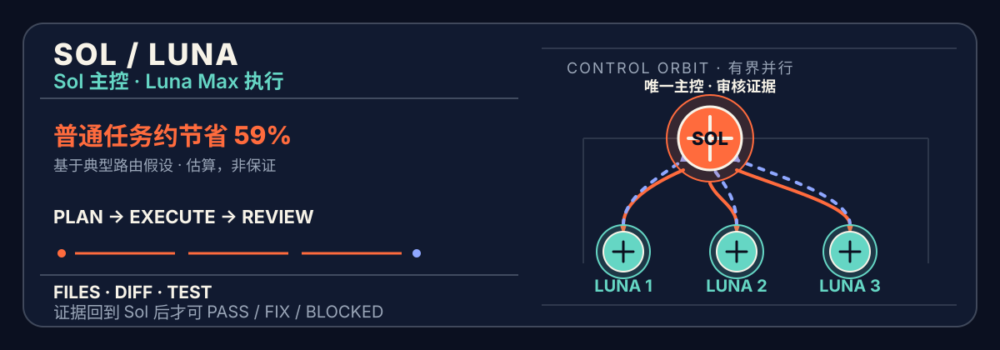
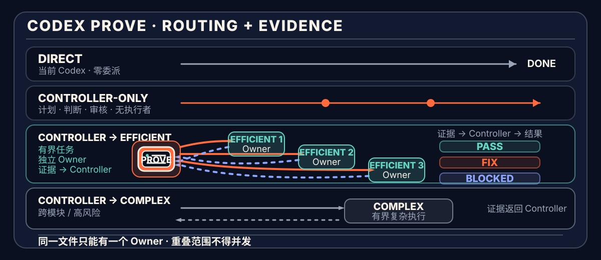

[简体中文](README.md) · [English](README.en.md)



# Sol Control

**Sol 单一主控。Terra High 与 Luna Max 分层执行。真实文件与证据通过后才交付。**

`codex-sol-control` 是一个面向 Codex 的轻量级编排 Skill。它不追求“更多 Agent”，而是让不同模型只承担最适合自己的工作：

- **Sol** 是唯一主控：理解目标、定义完成条件、规划、分配、调度并完成最终审核。
- **Terra High** 是复杂执行层：处理跨模块、长上下文、模糊调试、共享接口与高风险实现。
- **Luna Max** 是轻量执行层：承接清晰、低歧义、边界明确、可独立验证的任务。

简单任务仍由当前 Codex 直接完成。复杂、跨模块、可并行或高风险任务，再显式调用 `$sol-control`。

> **v0.4.x 兼容说明：**旧命令 `$sol-luna` 仍可显式调用，但它只会转交给 `$sol-control`，不会启动第二套编排流程。新配置请使用 `$sol-control`；兼容入口计划在 v0.5.0 移除。

运行时默认使用简体中文；如果用户明确指定其他语言，则遵循用户选择。

> **一个 Sol，两级执行。Terra 与 Luna 都是叶子执行者，不得创建子代理，也不得批准整体任务。**

规范仓库：[yehyakin/codex-sol-control](https://github.com/yehyakin/codex-sol-control)

## 核心路由与预计节省

下表以“同一任务全部使用 Sol”为 `1.00×` 基线。三个模型的 token 份额合计为 100%，`编排开销`表示额外的 Sol 规划、审核、协调和必要返工，相对于全 Sol 基线增加的成本。

| 场景 | 示例 token 路由 | 编排开销 | 预计节省 |
| --- | --- | ---: | ---: |
| **普通明确型项目** | Sol 10% · Terra 20% · Luna 70% | 3%–7% | **72.2%–76.2%** |
| **混合型项目** | Sol 20% · Terra 40% · Luna 40% | 2%–12% | **50.4%–60.4%** |
| **复杂型项目** | Sol 25% · Terra 60% · Luna 15% | 7%–17% | **33.4%–43.4%** |
| **Direct 小任务** | 当前 Codex 直接完成，不委派 | 0% | **路由节省 0%** |

## 为什么能节省成本

Sol Control 的节省逻辑很直接：

> **把高成本的目标理解、边界判断与最终审核留给 Sol；把实际执行按复杂度路由给 Terra 或 Luna。**

按 **2026-08-04** 的官方 API 价格与 Codex token-based rate card，同一种 token 类型下，三个模型的相对成本为：

| 模型 | 相对成本 | 在本项目中的职责 |
| --- | ---: | --- |
| **Sol** | **1.00×** | 理解、规划、分配、调度、最终审核 |
| **Terra High** | **0.40×** | 复杂、跨模块、长上下文或高风险执行 |
| **Luna Max** | **0.04×** | 清晰、低歧义、高吞吐执行 |

也就是说，在相同 token 类型下：

- Terra 的成本约为 Sol 的 **40%**；
- Luna 的成本约为 Sol 的 **4%**；
- Luna 不是 Sol 的替代品，而是把大量明确执行从 Sol 上移走，从而保留 Sol 的判断与审核能力。

这些数字属于 `scenario_model_projection`：它们用于预算规划，**不是匹配 A/B 实验、不是每个任务的保证，也不代表一定更快**。上下文重复、错误拆分、并行等待、输出量、Fast mode 和返工都可能降低甚至反转节省。

因此，更准确的公开说法是：

> **普通明确型项目可投影节省约 72%–76%，典型混合项目约 50%–60%，复杂项目约 33%–43%；实际结果必须按真实路由和 token 使用复算。**

而不是把所有任务概括成一个固定的“平均节省 56%”。

<details>
<summary><strong>查看官方费率、公式与完整计算</strong></summary>

### API 价格

每 1M tokens：

| Model | Input | Cached input | Output |
| --- | ---: | ---: | ---: |
| GPT-5.6 Sol | $5.00 | $0.50 | $30.00 |
| GPT-5.6 Terra | $2.00 | $0.20 | $12.00 |
| GPT-5.6 Luna | $0.20 | $0.02 | $1.20 |

### Codex token-based credits

每 1M tokens：

| Model | Input | Cached input | Output |
| --- | ---: | ---: | ---: |
| GPT-5.6 Sol | 125 credits | 12.5 credits | 750 credits |
| GPT-5.6 Terra | 50 credits | 5 credits | 300 credits |
| GPT-5.6 Luna | 5 credits | 0.5 credits | 30 credits |

当前两套口径的相对比例相同：

```text
Sol = 1.00
Terra = 0.40
Luna = 0.04
```

因此可以使用同一条相对成本公式：

```text
route_cost =
  sol_share × 1.00
  + terra_share × 0.40
  + luna_share × 0.04
  + orchestration_overhead

saving = 1 - route_cost
```

普通明确型项目示例：

```text
route_cost
= 0.10 × 1.00
+ 0.20 × 0.40
+ 0.70 × 0.04
+ 0.03–0.07
= 0.238–0.278

saving
= 1 - 0.238–0.278
= 72.2%–76.2%
```

API 用户看到的是美元金额；ChatGPT / Codex 用户通常看到的是 credits 或订阅容量。两者是不同计费单位，不能把 API 美元节省直接描述成订阅账单节省。

官方来源：

- [OpenAI model comparison](https://developers.openai.com/api/docs/models/compare)
- [OpenAI Codex rate card](https://help.openai.com/en/articles/20001106-codex-rate-card)

少量仍使用 legacy rate card 的 Enterprise 工作区，应以其实际适用费率为准。

</details>

## 60 秒开始

### macOS / Linux

```sh
git clone https://github.com/yehyakin/codex-sol-control.git
cd codex-sol-control

bash scripts/validate.sh
bash scripts/install.sh
```

### Windows

Windows PowerShell 5.1：

```powershell
git clone https://github.com/yehyakin/codex-sol-control.git
Set-Location codex-sol-control

powershell.exe -NoProfile -ExecutionPolicy Bypass -File scripts/validate.ps1
powershell.exe -NoProfile -ExecutionPolicy Bypass -File scripts/install.ps1
```

PowerShell 7：

```powershell
pwsh -NoProfile -File scripts/validate.ps1
pwsh -NoProfile -File scripts/install.ps1
```

安装后，打开新的 Codex 会话并显式调用：

```text
$sol-control

目标：为现有 Next.js 项目增加账号设置功能。

完成条件：
- 用户可以修改昵称和头像
- 保持现有认证 API 兼容
- 新增必要测试
- lint、test 和 build 全部通过

不要做：
- 不修改支付模块
- 不更换现有 UI 框架
```

也可以直接写：

```text
$sol-control 重构认证模块，保持现有 API 兼容，测试和构建必须通过。
```

你不需要指定 worker 数量，也不需要自己判断哪些任务交给 Terra 或 Luna。提供**目标、可观察的完成条件与明确限制**即可；Sol 负责形成最小可执行计划。

## 它解决什么问题

| 常见问题 | Sol Control 的处理方式 |
| --- | --- |
| 同一个 Agent 同时规划、实现和验证，容易顾此失彼 | Sol 专注判断与审核，Terra / Luna 专注有界执行 |
| 所有工作都使用最高成本模型 | 按复杂度把执行路由到 Terra 或 Luna |
| 多个执行者同时修改共享文件 | **一个文件，一个 owner**；重叠范围必须串行 |
| “完成”只有口头总结，没有真实证据 | 必须返回 changed paths、diff、测试、构建或产物 |
| 错误任务被无限重试 | 只允许一次有边界的修正，否则 `BLOCKED` |

它的目标不是制造一个热闹的多 Agent 团队，而是为复杂任务建立一个清晰、可审核的控制面。

## 工作方式



```text
用户目标
   │
   ▼
Sol：理解 → 规划 → 分配 → 调度
   │
   ├─ Direct：简单任务由当前 Codex 直接完成
   ├─ Sol-only：只做计划、分析或审核
   ├─ Luna Max：清晰、低歧义、可独立验证的执行
   └─ Terra High：跨模块、长上下文或高风险执行
   │
   ▼
真实文件 + Diff + 测试 / 构建 / 产物证据
   │
   ▼
Sol：PASS / FIX / BLOCKED
```

### 角色层级

| 角色 | 配置 | 负责什么 | 明确边界 |
| --- | --- | --- | --- |
| **Sol** | `gpt-5.6-sol` / `high` / `read-only` | 理解目标、定义 `done_when`、拆分任务、分配 owner、安排阶段、最终审核 | 不承担大批量机械实现 |
| **Terra High** | `gpt-5.6-terra` / `high` / `workspace-write` | 跨模块、长上下文、模糊调试、共享接口判断、高风险实现 | 不是第二个主控；不改计划、不创建子代理 |
| **Luna Max** | `gpt-5.6-luna` / `max` / `workspace-write` | 清晰、低歧义、小上下文、机械或高吞吐任务 | 不扩大 scope、不创建子代理、不批准整体任务 |

角色介绍按能力层级使用 **Sol → Terra → Luna**；任务路由按复杂度递进使用 **Direct → Luna → Terra**。

### 路由选择

| 路径 | 什么时候使用 | 成本含义 |
| --- | --- | --- |
| **Direct** | 单文件、小改动、目标清楚 | 不承担编排开销，路由节省为 0% |
| **Sol-only** | 需要规划、分析或审核，但不改文件 | 只使用主控能力 |
| **Sol → Luna** | scope 可精确划分，结果可独立验证 | 优先承接大量明确执行 |
| **Sol → Terra** | 跨模块、长上下文、共享接口、模糊调试或高风险实现 | 用更强执行层处理不能安全下放给 Luna 的工作 |

Terra 不是 Luna 的固定上级，也不是常驻第二主控。两者都是 Sol 根据任务风险选择的执行层。

### 多个执行者如何协作

复杂任务可以同时使用一个或多个 Terra / Luna worker，但并行由**文件所有权**决定，而不是由 Agent 数量决定：

```text
Stage 1
├─ Terra A → src/auth/core/*
├─ Luna A  → src/account/ui/*
└─ Luna B  → docs/account.md

Stage 2
└─ 原指定 owner → src/shared/routes.ts
```

只有 write scope 完全不重叠的任务才能同时执行。共享文件必须指定唯一 owner；依赖、共享接口或边界不确定时，Sol 会合并任务或改为串行执行。

worker 数量没有固定承诺。Sol 根据依赖关系、实时容量和安全边界分批启动最少数量的执行者。

## 一条完整的证据闭环

1. **计划。** Sol 写下目标、`done_when`、任务、依赖、精确 `write_scope`、排除项与验证方法。
2. **执行。** Terra 或 Luna 只修改分配范围，不改整体计划。
3. **自检。** 执行者运行指定验证并返回真实 changed paths、diff、测试、构建或产物证据。
4. **审核。** Sol 检查真实文件、完整 diff、证据新鲜度和需求覆盖。
5. **结论。** Sol 返回 `PASS`、一次 focused `FIX` 或 `BLOCKED`。

worker 的 `PASS` 只代表它自己的任务通过。只有 Sol 可以批准整体工作。

## 不可妥协的边界

1. **一个文件，一个 owner。** 同一轮执行中，不允许两个 worker 修改同一文件。
2. **执行者不能创建子代理。** Terra 与 Luna 都是叶子节点。
3. **没有证据，不算完成。** transport / spawn 的 `completed` 只表示投递结束。
4. **验证必须绑定最终候选。** 验证后文件发生变化，旧证据立即失效。
5. **最多一次 focused fix。** 原 owner 只能在原 scope 内修正一次；再次失败则 `BLOCKED`。
6. **失败关闭。** 无法证明 custom agent、精确 model、reasoning effort 或有效权限时，不静默替换。
7. **不降低审核门槛。** 用户催促、并行需求或成本目标都不能替代验证与证据。

### Luna 到 Terra 的有界升级

只有当 Luna 的第一次失败发生在它写入任何 owned file **之前**，Sol 才能把同一任务、同一 scope 一次升级给 Terra。

升级门槛只看 Luna 首次失败前是否零写入；Terra 的写入状态不是门槛。

一旦 Luna 已经写入 owned file，它保留该文件在本轮运行中的 ownership。Sol 只能把一次 focused fix 交回原 Luna owner，不能把已经写过的文件转交给 Terra 覆盖。

## 审核结果

| 结果 | 含义 |
| --- | --- |
| `PASS` | 所有完成条件均由真实文件和新鲜证据支持 |
| `FIX` | 原 owner 可以在不扩大 scope 的前提下完成一次精确修正 |
| `BLOCKED` | 权限、依赖、运行时身份、scope、冲突或验证问题阻止可信交付 |

## 什么时候不该使用

以下情况通常直接交给当前 Codex 更合适：

- 修改一个明确的小函数；
- 修复已定位的拼写、文案或样式；
- 只需要解释代码、回答问题或生成短文本；
- 无法划分独立 write scope；
- 编排、重复上下文与审核成本明显高于实现本身。

`$sol-control` 不是默认模式。**小任务保持 Direct，复杂任务才进入编排。**

## 安装、检查与卸载

### macOS / Linux

```sh
bash scripts/validate.sh
bash scripts/install.sh --check
bash scripts/install.sh

bash scripts/uninstall.sh
bash scripts/uninstall.sh --restore-latest
```

### Windows

```powershell
# Windows PowerShell 5.1
powershell.exe -NoProfile -ExecutionPolicy Bypass -File scripts/validate.ps1
powershell.exe -NoProfile -ExecutionPolicy Bypass -File scripts/install.ps1
powershell.exe -NoProfile -ExecutionPolicy Bypass -File scripts/uninstall.ps1
powershell.exe -NoProfile -ExecutionPolicy Bypass -File scripts/uninstall.ps1 -RestoreLatest

# PowerShell 7
pwsh -NoProfile -File scripts/validate.ps1
pwsh -NoProfile -File scripts/install.ps1
pwsh -NoProfile -File scripts/uninstall.ps1
pwsh -NoProfile -File scripts/uninstall.ps1 -RestoreLatest
```

安装器只管理本项目拥有的 Skill 与 agent 文件，并保留无关 agent 和用户自己的 `~/.codex/config.toml`。隔离生命周期测试时可使用 `ORCHESTRATE_HOME` 指定临时 home。

从 v0.3 升级时，安装器会先校验旧 `$sol-luna` Skill、三个 agent 与 ownership state，再迁移到 `~/.codex/sol-control`。`--restore-latest` 可恢复升级前的完整可管理状态；检测到用户修改、无 ownership 的目标或校验失败时会停止，不会覆盖。

平台与证据覆盖详见 [`docs/release/runtime-surface-matrix.md`](docs/release/runtime-surface-matrix.md)。

## 当前状态

当前发布基线为 **v0.4.0**。

| 验证面 | 已记录证据 |
| --- | --- |
| 本地仓库 | Skill Creator **PASS**；v0.4.0 候选版本 **113/113 tests PASS** |
| 托管 CI | [POSIX PASS](https://github.com/yehyakin/codex-sol-control/actions/runs/30956811267)：Ubuntu/macOS × Python 3.11/3.13；[Windows PASS](https://github.com/yehyakin/codex-sol-control/actions/runs/30956811107)：Windows Server 2022 / `windows-latest` × Windows PowerShell 5.1 / PowerShell 7 |
| Windows 实机安装 | 用户报告安装成功；未收集 Windows 版本、安装日志或运行时身份载荷，因此不扩展为 Native Nested 证明 |
| 运行表面 | Native Nested 已在 Codex CLI `0.146.0-alpha.9.2` 验证：`gpt-5.6-sol/high/read-only` → `gpt-5.6-luna/max/read-only` → Sol `PASS`；Compatibility 保留为回退；物理 Windows 11 尚未证明 |

更名、生命周期与身份握手实现提交为 [`848b210`](https://github.com/yehyakin/codex-sol-control/commit/848b210691fcfd91ec8b5374ba7b35c19c48e18e)；当前详见[完整实施报告](SOL_CONTROL_IMPLEMENTATION_REPORT.md)。

这些状态描述的是已记录证据范围，不推断未验证运行表面。

## 仓库结构

```text
.agents/skills/
├─ sol-control/                唯一完整 Skill
│  ├─ SKILL.md
│  └─ references/
│     ├─ orchestration.md      编排契约
│     └─ runtime-notes.md      运行时与调度说明
└─ sol-luna/                   v0.4.x 薄兼容入口

.codex/agents/
├─ sol-controller.toml
├─ terra-high-worker.toml
└─ luna-max-worker.toml

scripts/
├─ validate.*
├─ install.*
├─ uninstall.*
└─ test.sh

tests/                         contract、生命周期与 forward-case 测试
docs/                          发布证据、设计记录与 README 资源
README.md                      简体中文
README.en.md                   English
```

## 文档入口

- [Public Skill](.agents/skills/sol-control/SKILL.md)
- [编排契约](.agents/skills/sol-control/references/orchestration.md)
- [运行时说明](.agents/skills/sol-control/references/runtime-notes.md)
- [Sol 配置](.codex/agents/sol-controller.toml)
- [Terra High 配置](.codex/agents/terra-high-worker.toml)
- [Luna Max 配置](.codex/agents/luna-max-worker.toml)
- [运行表面矩阵](docs/release/runtime-surface-matrix.md)
- [真实项目路由样本](tests/real-project-benchmark.md)
- [v0.4.0 实施报告](SOL_CONTROL_IMPLEMENTATION_REPORT.md)

## 开发与测试

需要 Python 3.11 或更高版本。

```sh
bash scripts/validate.sh
bash scripts/test.sh
```

`scripts/test.sh` 会选择可用的 Python 3.11+，并运行完整 `unittest` 测试集。

修改 README 时应同步更新双语版本与文档测试。测试应保护事实、链接、费率快照、公式、安全边界和平台命令，不应把某一种营销文案或首页章节顺序永久锁死。

## 限制

- 成本区间是基于公开费率与示例 token 份额的预算投影，不是匹配 A/B benchmark。
- 真实 token 总量可能因规划、上下文重复、验证和返工而变化。
- Fast mode、超长上下文和不同输出比例可能改变实际消耗。
- 精确 custom agent、model、reasoning effort 与权限选择取决于宿主运行表面。
- 并行能力取决于实时容量和互不重叠的 write scope，不承诺固定 worker 数量。
- GitHub 托管 Windows runner 证明的是 Windows Server 行为，不等同于物理 Windows 11。
- Terra High 是复杂执行层，不是第二 planner 或 controller。
- 最终交付依赖真实文件、完整 diff 与新鲜验证；配置标签本身不是运行证据。

## 许可证

本仓库采用 [Apache License 2.0](LICENSE)。相关先例与归属记录见 [NOTICE](NOTICE)。

**致谢 / Thanks**

感谢 [LINUX DO 论坛](https://linux.do/) 社区的关注、反馈与支持
